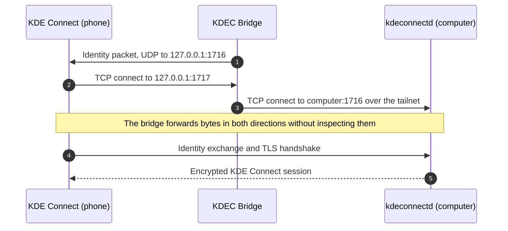
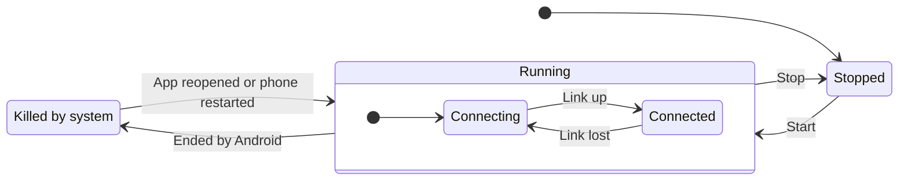

<p align="center">
  
</p>

<h1 align="center">KDEC Bridge</h1>

<p align="center">
  Use the stock KDE Connect app on Android with a computer on another network,<br>
  without giving up the phone's VPN slot.
</p>

---

KDE Connect works on the local network. To reach a computer from elsewhere, the usual approach is to put both devices on a Tailscale network, but on Android that requires the system `VpnService`, and only one VPN can be active at a time. If another VPN app holds the slot, KDE Connect cannot reach the computer.

KDEC Bridge removes the conflict. It runs a Tailscale node inside the app, in userspace and without a VPN interface, and presents the computer to KDE Connect as a device on the local network. KDE Connect's encryption and pairing are unchanged.

<p align="center">
  
</p>

## Contents

- [Features](#features)
- [How it works](#how-it-works)
- [Requirements](#requirements)
- [Quick start](#quick-start)
- [Configuration](#configuration)
- [Status and diagnostics](#status-and-diagnostics)
- [Transports](#transports)
- [Ports](#ports)
- [Battery use](#battery-use)
- [Privacy and security](#privacy-and-security)
- [Limitations](#limitations)
- [Building](#building)
- [Project structure](#project-structure)
- [Support](#support)
- [License](#license)

## Features

- **Works with stock KDE Connect.** No fork, no root, no changes to the KDE Connect app.
- **Keeps the VPN slot free.** Runs alongside any VPN app.
- **No open ports.** Connects through Tailscale with NAT traversal. No port forwarding or relay server is required.
- **End-to-end encryption.** KDE Connect's TLS session and certificate pinning pass through the bridge unchanged. The bridge cannot read the traffic.
- **Automatic identity setup.** Learns the computer's KDE Connect identity from the computer itself. Several computers can be used.
- **All plugins, including file transfer** in both directions.
- **Low battery use.** Event-driven, with no polling, wakelocks or alarms.
- **Recovers on its own.** Restarts after a reboot and records when Android stops the service.

## How it works

KDE Connect on Android opens its TCP connection to the address that sent it an identity packet, and it treats loopback as a local address. KDEC Bridge relies on this behavior:

1. The bridge sends the computer's identity packet to KDE Connect's UDP port, `127.0.0.1:1716`, advertising TCP port 1717.
2. KDE Connect connects to `127.0.0.1:1717`, where the bridge is listening.
3. The bridge forwards the connection to `kdeconnectd` on the computer over the tailnet.



Because the bridge only forwards bytes, the identity exchange and TLS handshake take place directly between KDE Connect and `kdeconnectd`. Existing pairings continue to work.

[docs/architecture.md](docs/architecture.md) covers identity discovery, file transfer, link monitoring and the service lifecycle in detail.

## Requirements

- **Phone:** Android 8.0 (API 26) or later on a 64-bit ARM (`arm64-v8a`) device.
- **KDE Connect app on the phone:** the official [KDE Connect](https://kdeconnect.kde.org/) app, from Google Play or F-Droid. KDEC Bridge works alongside it and does not replace it.
- **Computer:** KDE Connect (`kdeconnectd`) running, and [Tailscale](https://tailscale.com/) installed and logged in.
- **Tailscale account:** the phone joins the same tailnet as the computer.

KDEC Bridge itself is not published on any app store and has no prebuilt download. Build the APK from source as described in [Building](#building).

## Quick start

1. **Build and install the app.** See [Building](#building).
2. **Find the computer's MagicDNS name.** On the computer, run:

   ```bash
   tailscale status --json | grep -m1 '"DNSName"'
   ```

   The name has the form `computer-name.your-tailnet.ts.net`. Omit the trailing dot.
3. **Configure the app.** Open KDEC Bridge, leave **Use Tailscale (tsnet)** checked, and enter the MagicDNS name as the computer address. Paste a Tailscale auth key, or leave the field empty to sign in from the app.
4. **Start the bridge.** If the status shows `LOGIN NEEDED`, tap **Authenticate tailnet** and approve the device.
5. **Allow background operation.** Tap **Exempt from battery optimization** and confirm.
6. **Pair.** Open KDE Connect on the phone. The computer appears as an available device; pair it as usual. Devices that were already paired reconnect automatically.

The banner turns green (`● CONNECTED`) once KDE Connect is linked. See [docs/setup.md](docs/setup.md) for the full walkthrough and troubleshooting.

## Configuration

All settings are on the app's main screen, in the order listed.

| Setting | Description | Default |
|---|---|---|
| Use Tailscale (tsnet) | Selects the transport: userspace Tailscale when checked, plain TCP (`direct`) when unchecked | Checked |
| Computer address | tsnet: the computer's MagicDNS name. Direct: a LAN address or relay host | — |
| Tailscale auth key | Registers the phone as a tailnet node. Cleared after first use. Leave empty to sign in through the browser | Empty |
| Tailnet node name | Hostname the phone registers under, as shown in the Tailscale admin console | `kdec-bridge` |
| kdeconnectd port | Port on which `kdeconnectd` is reachable through the transport. Change only when a relay maps it elsewhere | `1716` |
| Reconnect interval | Seconds between reconnection attempts while disconnected (minimum 2) | `10` |
| Payload port offset | Added to file transfer ports when connecting. Only for relays that map 1739–1764 to another range | `0` |
| Proxy payload ports | Enables file transfer. When unchecked, all other plugins still work | Checked |

| Button | Action |
|---|---|
| Start bridge / Stop bridge | Starts or stops the background service. A stop from here is recorded as intentional |
| Authenticate tailnet | Opens the pending Tailscale login page. Only needed when no auth key was given |
| Learn computer identity | Asks the computer for its identity and stores it for the current address. This normally happens automatically. In tsnet mode the bridge must be running |
| Forget learned identity | Deletes the stored identity for the current address. Use this when the computer's KDE Connect identity has changed, for example after a reinstall |
| Inject once (test) | Sends a single identity packet to KDE Connect, for diagnostics |
| Exempt from battery optimization | Opens the system dialog. Required for reliable background operation |

## Status and diagnostics

### Status banner



| Banner | Meaning |
|---|---|
| `● CONNECTED` | KDE Connect has a live link through the bridge |
| `○ CONNECTING…` | The service is running without a link: starting up, the computer is offline, or tailnet login is pending |
| `■ KILLED BY SYSTEM` | The service stopped without a request, usually because of Doze, memory pressure or a task killer |
| `○ STOPPED` | Stopped from the app |

### Status details

| Field | Meaning |
|---|---|
| `mode` | `tsnet` or `direct` |
| `target` | Computer address and port |
| `listen` | Loopback port that KDE Connect connects to. If 1717 is taken, the service uses the next free port up to 1738 and advertises that one |
| `identity` | Identity in use, marked `[learned]` or `[not learned]`. Until an identity is learned, a placeholder is shown that cannot pair |
| `tailnet` | tsnet node state. Shows `LOGIN NEEDED` while authentication is pending |
| `started` | When the service started |
| `last beat` | Last heartbeat. After an unexpected stop, this is when the service was last running |
| `battery` | `exempt`, or a warning that Doze may stop the service |

The screen refreshes every second while it is open.

### Event log

The event log is timestamped and stored in the app's private storage, so it survives the process being killed. It can also be read over USB:

```bash
adb shell run-as dev.kdecbridge cat files/events.log
```

| Message | Meaning |
|---|---|
| `service started (mode=…, target=…)` | The service started |
| `tailnet up as <name>` | The tsnet node is authenticated and online |
| `forward :1717->1716 + payload :1739-1743` | Loopback listeners are ready |
| `reverse tailnet :1744-1764 -> loopback` | Tailnet listeners for transfers started by the phone are ready |
| `linked :1717 -> <target>` | KDE Connect connected through the bridge |
| `LINK UP` / `LINK DOWN` | Link state changed. Reported as it happens, without polling |
| `dial … failed: connection refused` | The computer is reachable, but `kdeconnectd` is not running |
| `dial … failed: no such host` | MagicDNS does not resolve yet. Expected for a few seconds after start-up |
| `network changed - re-checking link` | The phone switched networks; the link is checked immediately |
| `app swiped out of recents` | The app was swiped away. The service keeps running |
| `SERVICE DESTROYED while running` | The service was stopped without a request |
| `identity: learned from <name>` | Discovery succeeded and the identity was stored for this address |
| `identity: adopted <name>` | A link came up with the current identity, which confirms it; it was stored |
| `identity: discovery failed … will retry` | Discovery is retried while no identity is stored and KDE Connect is disconnected |
| `port N busy, control channel on :M` | The preferred port was taken; KDE Connect is given the port in use |
| `!! previous session ended unexpectedly - last alive HH:MM:SS` | Written at the next launch after the service was killed. Check for this line first if the bridge keeps stopping |
| `restarting bridge after unexpected death` | The bridge was restarted automatically |

## Transports

| Transport | Setup required | Open ports | Works away from home |
|---|---|---|---|
| `tsnet` (default) | Tailscale on the computer | None | Yes |
| `direct` to a LAN address | None | None | No |
| `direct` to a relay | A relay host and port forwarding | Yes | Yes |

**tsnet** embeds a complete Tailscale node in the app: WireGuard and a userspace TCP/IP stack, with no TUN device and therefore no `VpnService`. Tailscale sets up a direct peer-to-peer path where the network allows it, and otherwise falls back to its DERP relays. Traffic is end-to-end encrypted in both cases.

**direct** opens plain TCP connections to the configured host. It is suited to a LAN, or to a TCP relay such as Nginx Proxy Manager; [`tools/npm-streams.sh`](tools/npm-streams.sh) creates the required streams through the Nginx Proxy Manager API.

Tested on Android 16 with KDE Connect 26.08 on the computer. With Wi-Fi disabled, so that mobile data was the only route, Tailscale established a direct peer-to-peer path without a DERP relay, and a ping and a file transfer both succeeded. With a full-tunnel VPN active on the phone, a direct path may not be found; traffic then goes through DERP, which is slower but still end-to-end encrypted.

## Ports

| Port | Listens on | Purpose |
|---|---|---|
| 1716 | — | KDE Connect's UDP port on the phone. The bridge sends identity packets here |
| 1717 | Loopback | Control channel. Falls back to the next free port up to 1738 |
| 1725–1738 | Tailnet or LAN | Temporary listener during identity discovery |
| 1739–1743 | Loopback | File transfers started by the computer |
| 1744–1764 | Tailnet | File transfers started by the phone |

The file transfer range is split by direction. Holding 1739–1743 on loopback moves KDE Connect's own transfer server on the phone to port 1744 or higher, where the tailnet listeners accept the computer's connections. In direct mode, the bridge forwards the full range 1739–1764 from loopback. See [docs/architecture.md](docs/architecture.md#file-transfer).

## Battery use

Measured over 2 hours 47 minutes of service uptime:

| Metric | Result |
|---|---|
| Partial wakelocks held | None |
| Wi-Fi sleep time | 99.9% |
| Radio active time (Rx + Tx) | 6.9 s |

The app uses no wakelocks or alarms, so it neither keeps the phone awake nor wakes it from Doze. Most network activity is Tailscale's own keepalive traffic.

The bridge does not poll while connected. Its injection loop sleeps until a link opens or closes, the network changes, or a 120-second safety timeout expires; the timeout also serves as the heartbeat. While disconnected, it retries at the reconnect interval. Intervals below 2 seconds have no benefit, because KDE Connect accepts at most one connection per second from an address.

## Privacy and security

- **Traffic.** The bridge forwards bytes without inspecting them. KDE Connect's TLS session runs end to end between the phone and the computer.
- **No telemetry.** Apart from connections to the computer, all network traffic is Tailscale's own: coordination, NAT traversal and DERP relays. Tailscale's diagnostic log upload is disabled.
- **Credentials.** The auth key is removed from the app's settings once the node has registered. The node's keys are kept in the app's private storage.
- **Backups.** App data is excluded from Android cloud backups and device-to-device transfers, so node keys and learned identities stay on the phone.
- **Exposure.** In tsnet mode, nothing listens on a public interface. Loopback listeners accept connections only from the phone itself, and tailnet listeners only from the tailnet.

## Limitations

- 64-bit ARM (`arm64-v8a`) only.
- No prebuilt APK is published. Building from source produces a debug-signed APK, which is installed by sideloading.
- Identity discovery requires a path on which the computer can connect back to the phone, so it does not work through a relay. tsnet and LAN connections are unaffected. In relay setups, the identity is stored once a link has been established.
- Android requires a visible notification for foreground services. It can be hidden by turning off the app's notifications; see [docs/setup.md](docs/setup.md#8-hide-the-notification-optional).

## Building

Requirements: JDK 21, Android SDK platform 35, Android NDK 27, Go 1.27 or later, gomobile, and Gradle 8.11.

```bash
./tools/build-aar.sh      # builds app/libs/tsbridge.aar from tsbridge/
gradle assembleDebug      # builds app/build/outputs/apk/debug/app-debug.apk
adb install -r app/build/outputs/apk/debug/app-debug.apk
```

See [docs/building.md](docs/building.md) for toolchain setup and build details.

## Project structure

```
app/                         Android app (Kotlin)
  src/main/java/dev/kdecbridge/
    BridgeService.kt         Foreground service: transport, injection loop, link state
    MainActivity.kt          Settings, controls, status and event log
    Injector.kt              Sends identity packets to KDE Connect over loopback
    IdentityDiscovery.kt     Learns the computer's identity
    PortProxy.kt             Loopback TCP forwarder (direct mode)
    Transport.kt             Plain TCP transport (direct mode)
    AndroidNetInfo.kt        Supplies network interfaces to tsnet
    Config.kt                Settings and protocol constants
    EventLog.kt              Persistent event log
    BootReceiver.kt          Restarts the bridge after a reboot
tsbridge/                    Go library: userspace Tailscale node and forwarders
tools/
  build-aar.sh               Builds the Go library with gomobile
  npm-streams.sh             Creates Nginx Proxy Manager streams for relay setups
docs/                        Setup, architecture and build documentation
```

## Support

KDEC Bridge is free and open source. If you find it useful, you can support its development on [Ko-fi](https://ko-fi.com/rnkio).

## License

Released under the [MIT License](LICENSE).

Developed with the assistance of Claude (Anthropic). KDEC Bridge is an independent project and is not affiliated with KDE or Tailscale.
