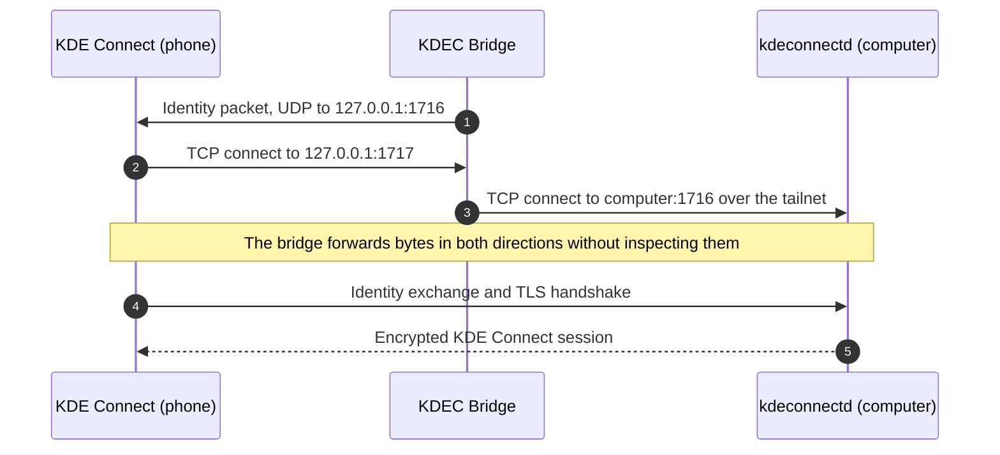
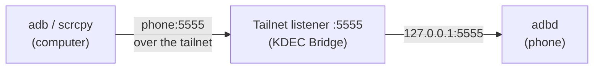
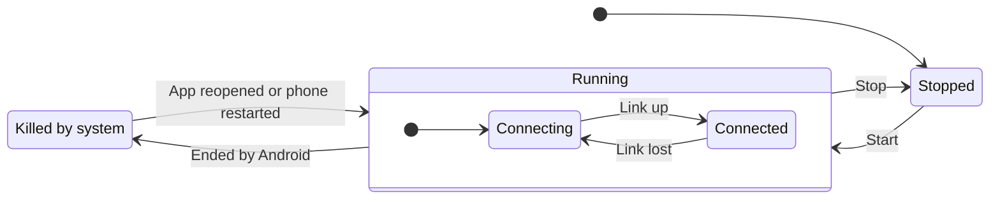

<p align="center">
  
</p>

<h1 align="center">KDEC Bridge</h1>

<p align="center">
  KDE Connect and scrcpy between an Android phone and a computer on another network,<br>
  without giving up the phone's VPN slot.
</p>

---

To connect a phone and a computer on different networks, the usual approach is to put both on a Tailscale network. On Android that requires the system `VpnService`, and only one VPN can be active at a time. If another VPN app holds the slot, KDE Connect on the phone cannot reach the computer, and `adb` and scrcpy on the computer cannot reach the phone.

KDEC Bridge removes the conflict. It runs a Tailscale node inside the app, in userspace and without a VPN interface, and carries two services over it:

- **KDE Connect.** The stock KDE Connect app sees the computer as a device on the local network. Pairing and encryption are unchanged.
- **ADB for scrcpy.** `adb` and [scrcpy](https://github.com/Genymobile/scrcpy) on the computer reach the phone by its tailnet name, on Wi-Fi or mobile data. The bridge keeps the phone's ADB port open across restarts.

<p align="center">
  
</p>

## Contents

- [Features](#features)
- [How it works](#how-it-works)
- [Requirements](#requirements)
- [Quick start](#quick-start)
- [Configuration](#configuration)
- [Status and diagnostics](#status-and-diagnostics)
- [Transports](#transports)
- [Ports](#ports)
- [Battery use](#battery-use)
- [Privacy and security](#privacy-and-security)
- [Limitations](#limitations)
- [Building](#building)
- [Project structure](#project-structure)
- [Support](#support)
- [License](#license)

## Features

### The bridge

- **Keeps the VPN slot free.** Runs alongside any VPN app.
- **No open ports.** Connects through Tailscale with NAT traversal. No port forwarding or relay server is required.
- **Encrypted in transit.** Over the tailnet, all traffic is carried inside WireGuard. KDE Connect's own TLS session also runs end to end, and the bridge cannot read it.
- **No root.** Works with the stock KDE Connect app and Android's own ADB daemon.
- **Low battery use.** Event-driven, with no polling, wakelocks or alarms.
- **Recovers on its own.** Restarts after a reboot or an app update, and records when Android stops the service.

### KDE Connect

- **Works with the stock app.** No fork and no changes to the KDE Connect app.
- **Automatic identity setup.** Learns the computer's KDE Connect identity from the computer itself. Several computers can be used.
- **All plugins, including file transfer** in both directions.

### ADB for scrcpy

- **Reach the phone from anywhere.** `adb connect` and scrcpy work over the tailnet, by the phone's tailnet name.
- **Stays on.** Opens the ADB port again after a restart, when Wi-Fi connects, or when USB debugging is turned back on.
- **One-time setup.** Allow the app's ADB key with one tap on the phone's "Allow USB debugging?" prompt, or pair it with Wireless debugging.
- **Simple to switch off.** **Turn off TCP ADB** closes the port on every network; **Turn on TCP ADB** opens it again.

## How it works

The bridge is a foreground service with an embedded Tailscale node. Each service uses the tailnet in its own direction:

| Service | Started by | Listeners on the phone | Other end |
|---|---|---|---|
| KDE Connect | KDE Connect on the phone | Loopback 1717 and 1739–1743, tailnet 1744–1764 for file transfers | `kdeconnectd` on the computer, port 1716 |
| ADB for scrcpy | `adb` or scrcpy on the computer | Tailnet 5555 | adbd on the phone, loopback port 5555 |

In both cases the bridge only forwards bytes. It takes no part in KDE Connect's TLS handshake or in ADB's authentication.

### KDE Connect

KDE Connect on Android opens its TCP connection to the address that sent it an identity packet, and it treats loopback as a local address. KDEC Bridge relies on this behavior:

1. The bridge sends the computer's identity packet to KDE Connect's UDP port, `127.0.0.1:1716`, advertising TCP port 1717.
2. KDE Connect connects to `127.0.0.1:1717`, where the bridge is listening.
3. The bridge forwards the connection to `kdeconnectd` on the computer over the tailnet.



The identity exchange and TLS handshake take place directly between KDE Connect and `kdeconnectd`, so existing pairings continue to work.

### ADB for scrcpy

adbd, Android's ADB daemon, listens on TCP port 5555 once it is switched to TCP mode, as `adb tcpip 5555` does. The bridge forwards the phone's tailnet port 5555 to it:



Only an ADB client can switch adbd to TCP mode, so the bridge acts as one. Once adbd trusts the app's own ADB key, the bridge connects to adbd on the phone and sends the same request as `adb tcpip 5555`. Port 5555 then stays open on every network until the phone restarts or USB debugging is turned off.

**Allowing the app's key.** This is done once, in one of two ways:

- **From a computer.** Connect the phone by USB, run `adb tcpip 5555`, then tap **Turn on TCP ADB** and allow the "Allow USB debugging?" prompt with **Always allow** ticked.
- **By pairing with Wireless debugging.** No computer is needed. Open Settings and KDEC Bridge in split screen, tap **Pair device with pairing code** in Settings, and enter the code in the app.

**Keeping the port open.** While TCP ADB is on, the bridge checks port 5555 when the service starts (including after a reboot or an app update), when the phone joins a Wi-Fi network, when USB debugging is turned on, and every 10 minutes. If the port is closed, the bridge opens it again through Wireless debugging. This needs:

- **Wi-Fi.** Android allows Wireless debugging only on Wi-Fi. Once port 5555 is open, it stays open on mobile data and on other networks.
- **A Wi-Fi network allowed for Wireless debugging.** Android asks once per network; tick **Always allow on this network**. On a network that is not allowed, Android refuses while the screen is locked and asks while it is unlocked.
- **USB debugging on.** Turning USB debugging off closes port 5555. The bridge never turns USB debugging on.

**Turn off TCP ADB** closes port 5555 on every network, turns Wireless debugging off and stops the bridge from opening the port again.

[docs/architecture.md](docs/architecture.md) covers both services in detail: identity discovery, file transfer and link monitoring for KDE Connect, and the ADB client, key authorization and pairing protocol for ADB.

## Requirements

| | KDE Connect | ADB for scrcpy |
|---|---|---|
| Phone | The official [KDE Connect](https://kdeconnect.kde.org/) app, from Google Play or F-Droid | Developer options with USB debugging on. Android 11 or later for the bridge to open the port by itself |
| Computer | KDE Connect (`kdeconnectd`) running | `adb` and [scrcpy](https://github.com/Genymobile/scrcpy) |

Both services also need:

- **Phone:** Android 8.0 (API 26) or later on a 64-bit ARM (`arm64-v8a`) device.
- **Computer:** [Tailscale](https://tailscale.com/) installed and logged in.
- **Tailscale account:** the phone joins the same tailnet as the computer.

On Android 8 to 10, which have no Wireless debugging, ADB forwarding works, but port 5555 has to be opened with `adb tcpip 5555` from a computer after each restart.

KDEC Bridge is not on any app store. Download the APK from the [latest release](https://github.com/rnk-io/kdec-bridge/releases/latest), or build it from source as described in [Building](#building).

## Quick start

### The bridge

1. **Install the app.** Download the APK from the [latest release](https://github.com/rnk-io/kdec-bridge/releases/latest) and open it on the phone. To build it yourself instead, see [Building](#building).
2. **Find the computer's MagicDNS name.** On the computer, run:

   ```bash
   tailscale status --json | grep -m1 '"DNSName"'
   ```

   The name has the form `computer-name.your-tailnet.ts.net`. Omit the trailing dot.
3. **Configure the app.** Open KDEC Bridge, leave **Use Tailscale (tsnet)** checked, and enter the MagicDNS name as the computer address. Paste a Tailscale auth key, or leave the field empty to sign in from the app.
4. **Start the bridge.** If the status shows `LOGIN NEEDED`, tap **Authenticate tailnet** and approve the device.
5. **Allow background operation.** Tap **Exempt from battery optimization** and confirm.

### KDE Connect

6. **Pair.** Open KDE Connect on the phone. The computer appears as an available device; pair it as usual. Devices that were already paired reconnect automatically.

The banner turns green (`● CONNECTED`) once KDE Connect is linked.

### ADB for scrcpy

7. **Turn on TCP ADB and allow the app's key.** Connect the phone by USB and run `adb tcpip 5555` on the computer. In KDEC Bridge, tap **Turn on TCP ADB**, then tick **Always allow** on the "Allow USB debugging?" prompt and allow it. The `adb` line in the status changes to `on - :5555 open, forwarded from the tailnet`. To pair with Wireless debugging instead, see [docs/setup.md](docs/setup.md#10-allow-the-apps-adb-key).
8. **Connect from the computer,** using the phone's tailnet name, which is the **Tailnet node name** set in the app:

   ```bash
   scrcpy --tcpip=kdec-bridge.your-tailnet.ts.net:5555
   ```

   The USB cable is no longer needed.

[docs/setup.md](docs/setup.md) has the full walkthrough and troubleshooting for both services.

## Configuration

All settings are on the app's main screen, in the order listed.

| Setting | Description | Default |
|---|---|---|
| Use Tailscale (tsnet) | Selects the transport: userspace Tailscale when checked, plain TCP (`direct`) when unchecked. ADB forwarding needs tsnet | Checked |
| Computer address | tsnet: the computer's MagicDNS name. Direct: a LAN address or relay host | — |
| Tailscale auth key | Registers the phone as a tailnet node. Cleared after first use. Leave empty to sign in through the browser | Empty |
| Tailnet node name | Hostname the phone registers under, as shown in the Tailscale admin console. `adb` and scrcpy connect to this name | `kdec-bridge` |
| kdeconnectd port | Port on which `kdeconnectd` is reachable through the transport. Change only when a relay maps it elsewhere | `1716` |
| Reconnect interval | Seconds between KDE Connect reconnection attempts while disconnected (minimum 2) | `10` |
| Payload port offset | Added to file transfer ports when connecting. Only for relays that map 1739–1764 to another range | `0` |
| Proxy payload ports | Enables KDE Connect file transfer. When unchecked, all other plugins still work | Checked |

**Bridge and KDE Connect**

| Button | Action |
|---|---|
| Start bridge / Stop bridge | Starts or stops the background service. A stop from here is recorded as intentional |
| Authenticate tailnet | Opens the pending Tailscale login page. Only needed when no auth key was given |
| Learn computer identity | Asks the computer for its identity and stores it for the current address. This normally happens automatically. In tsnet mode the bridge must be running |
| Forget learned identity | Deletes the stored identity for the current address. Use this when the computer's KDE Connect identity has changed, for example after a reinstall |
| Inject once (test) | Sends a single identity packet to KDE Connect, for diagnostics |
| Exempt from battery optimization | Opens the system dialog. Required for reliable background operation |

**ADB for scrcpy**

| Button | Action |
|---|---|
| Turn on TCP ADB | Opens ADB on port 5555, forwards it from the tailnet and keeps it open. The first time, asks you to allow the app's ADB key |
| Turn off TCP ADB | Closes port 5555 on every network, turns Wireless debugging off and stops the bridge from opening the port again. KDE Connect is not affected |

## Status and diagnostics

### Status banner

The banner shows the KDE Connect link. TCP ADB has its own line in the status details.



| Banner | Meaning |
|---|---|
| `● CONNECTED` | KDE Connect has a live link through the bridge |
| `○ CONNECTING…` | The service is running without a link: starting up, the computer is offline, or tailnet login is pending |
| `■ KILLED BY SYSTEM` | The service stopped without a request, usually because of Doze, memory pressure or a task killer |
| `○ STOPPED` | Stopped from the app |

### Status details

| Field | Meaning |
|---|---|
| `mode` | `tsnet` or `direct` |
| `target` | Computer address and port |
| `listen` | Loopback port that KDE Connect connects to. If 1717 is taken, the service uses the next free port up to 1738 and advertises that one |
| `identity` | Identity in use, marked `[learned]` or `[not learned]`. Until an identity is learned, a placeholder is shown that cannot pair |
| `tailnet` | tsnet node state. Shows `LOGIN NEEDED` while authentication is pending |
| `started` | When the service started |
| `last beat` | Last heartbeat. After an unexpected stop, this is when the service was last running |
| `battery` | `exempt`, or a warning that Doze may stop the service |
| `adb` | `off`, `on - :5555 open, forwarded from the tailnet`, or why port 5555 is closed, for example `waiting for Wi-Fi` |

The screen refreshes every second while it is open.

### Event log

The event log is timestamped and stored in the app's private storage, so it survives the process being killed. Entries from the running service also go to logcat, where they can be read over USB:

```bash
adb logcat -s KdecBridge
```

**Bridge and KDE Connect**

| Message | Meaning |
|---|---|
| `service started (mode=…, target=…)` | The service started |
| `tailnet up as <name>` | The tsnet node is authenticated and online |
| `forward :1717->1716 + payload :1739-1743` | Loopback listeners are ready |
| `reverse tailnet :1744-1764 -> loopback` | Tailnet listeners for transfers started by the phone are ready |
| `linked :1717 -> <target>` | KDE Connect connected through the bridge |
| `LINK UP` / `LINK DOWN` | Link state changed. Reported as it happens, without polling |
| `dial … failed: connection refused` | The computer is reachable, but `kdeconnectd` is not running |
| `dial … failed: no such host` | MagicDNS does not resolve yet. Expected for a few seconds after start-up |
| `network changed - re-checking link` | The phone switched networks; the link is checked immediately |
| `app swiped out of recents` | The app was swiped away. The service keeps running |
| `SERVICE DESTROYED while running` | The service was stopped without a request |
| `identity: learned from <name>` | Discovery succeeded and the identity was stored for this address |
| `identity: adopted <name>` | A link came up with the current identity, which confirms it; it was stored |
| `identity: discovery failed … will retry` | Discovery is retried while no identity is stored and KDE Connect is disconnected |
| `port N busy, control channel on :M` | The preferred port was taken; KDE Connect is given the port in use |
| `!! previous session ended unexpectedly - last alive HH:MM:SS` | Written at the next launch after the service was killed. Check for this line first if the bridge keeps stopping |
| `restarting bridge after unexpected death` | The bridge was restarted automatically |

**ADB for scrcpy**

| Message | Meaning |
|---|---|
| `adb: tailnet :5555 -> 127.0.0.1:5555 open` | The tailnet listener for ADB is ready |
| `adb: tailnet connection -> 127.0.0.1:5555` | `adb` or scrcpy on the computer connected |
| `adb: key allowed on the phone` | The app's key was allowed through the "Allow USB debugging?" prompt |
| `adb: paired with Wireless debugging` | The app's key was paired with Wireless debugging |
| `adb: granted WRITE_SECURE_SETTINGS` | The app can now switch Wireless debugging on and off |
| `adb: turning TCP ADB on (…)` | Port 5555 was closed and the bridge is opening it, with the reason, for example `Wi-Fi connected` |
| `adb: TCP ADB on, :5555 open` | adbd is listening on port 5555 |
| `adb: waiting for Wi-Fi` | Port 5555 is closed, and opening it needs Wi-Fi |
| `adb: Wireless debugging is not allowed on this Wi-Fi network …` | Android refused Wireless debugging on this network. Allow it once in Developer options |
| `adb: TCP ADB off, :5555 closed` | TCP ADB was turned off in the app |

## Transports

| Transport | Setup required | Open ports | Works away from home | ADB forwarding |
|---|---|---|---|---|
| `tsnet` (default) | Tailscale on the computer | None | Yes | Yes |
| `direct` to a LAN address | None | None | No | No |
| `direct` to a relay | A relay host and port forwarding | Yes | Yes | No |

**tsnet** embeds a complete Tailscale node in the app: WireGuard and a userspace TCP/IP stack, with no TUN device and therefore no `VpnService`. Tailscale sets up a direct peer-to-peer path where the network allows it, and otherwise falls back to its DERP relays. Traffic is end-to-end encrypted in both cases.

**direct** opens plain TCP connections to the configured host, for KDE Connect only. It is suited to a LAN, or to a TCP relay such as Nginx Proxy Manager; [`tools/npm-streams.sh`](tools/npm-streams.sh) creates the required streams through the Nginx Proxy Manager API. TCP ADB can still be turned on in direct mode, but port 5555 is then reachable only on the phone's local networks.

Tested on Android 16 with KDE Connect 26.08 on the computer:

- With Wi-Fi disabled, so that mobile data was the only route, Tailscale established a direct peer-to-peer path without a DERP relay, and a ping and a file transfer both succeeded.
- With a full-tunnel VPN active on the phone, scrcpy worked over the tailnet on Wi-Fi and `adb` on mobile data, and TCP ADB was turned back on automatically when Wi-Fi reconnected with the screen locked.

With a full-tunnel VPN active, a direct path may not be found; traffic then goes through DERP, which is slower but still end-to-end encrypted. For scrcpy through DERP, lower the bit rate and size, for example `--video-bit-rate=4M --max-size=1600`.

## Ports

| Port | Service | Listens on | Purpose |
|---|---|---|---|
| 1716 | KDE Connect | — | KDE Connect's UDP port on the phone. The bridge sends identity packets here |
| 1717 | KDE Connect | Loopback | Control channel. Falls back to the next free port up to 1738 |
| 1725–1738 | KDE Connect | Tailnet or LAN | Temporary listener during identity discovery |
| 1739–1743 | KDE Connect | Loopback | File transfers started by the computer |
| 1744–1764 | KDE Connect | Tailnet | File transfers started by the phone |
| 5555 | ADB | Tailnet | Forwarded to adbd on loopback. Only while TCP ADB is on |

The file transfer range is split by direction. Holding 1739–1743 on loopback moves KDE Connect's own transfer server on the phone to port 1744 or higher, where the tailnet listeners accept the computer's connections. In direct mode, the bridge forwards the full range 1739–1764 from loopback. See [docs/architecture.md](docs/architecture.md#file-transfer).

While TCP ADB is on, adbd itself listens on port 5555 on all interfaces, not only on loopback. See [Privacy and security](#privacy-and-security).

## Battery use

Measured over 2 hours 47 minutes of service uptime:

| Metric | Result |
|---|---|
| Partial wakelocks held | None |
| Wi-Fi sleep time | 99.9% |
| Radio active time (Rx + Tx) | 6.9 s |

The app uses no wakelocks or alarms, so it neither keeps the phone awake nor wakes it from Doze. Most network activity is Tailscale's own keepalive traffic.

The bridge does not poll while connected. Its injection loop sleeps until a link opens or closes, the network changes, or a 120-second safety timeout expires; the timeout also serves as the heartbeat. While disconnected, it retries at the reconnect interval. Intervals below 2 seconds have no benefit, because KDE Connect accepts at most one connection per second from an address.

TCP ADB adds no background work of its own. Its checks run when the network or the USB debugging setting changes, and otherwise at most every 10 minutes, as a single loopback connection while the port is open.

## Privacy and security

- **Traffic.** The bridge forwards bytes without inspecting them. KDE Connect's TLS session runs end to end between the phone and the computer, and ADB sessions are authenticated by adbd on the phone.
- **No telemetry.** Apart from connections to the computer, all network traffic is Tailscale's own: coordination, NAT traversal and DERP relays. Tailscale's diagnostic log upload is disabled.
- **Credentials.** The auth key is removed from the app's settings once the node has registered. The node's keys are kept in the app's private storage.
- **Backups.** App data is excluded from Android cloud backups and device-to-device transfers, so node keys, learned identities and the ADB key stay on the phone.
- **Exposure.** In tsnet mode, the bridge listens on no public interface. Loopback listeners accept connections only from the phone itself, and tailnet listeners only from the tailnet.
- **TCP ADB.** While TCP ADB is on, adbd accepts connections on port 5555 on every network the phone is connected to, not only through the tailnet. Each computer still has to be allowed on the phone. Classic ADB over TCP is authenticated but not encrypted; through the tailnet, WireGuard encrypts it. If the tailnet is shared, restrict port 5555 on the phone to your computer with a Tailscale access rule. Tap **Turn off TCP ADB** when it is not needed.
- **ADB key.** The app creates its own ADB key on the phone and keeps it in private storage. It uses the key only to connect to adbd on the phone itself. The `WRITE_SECURE_SETTINGS` permission is granted to the app over ADB once its key is trusted, and is used only to switch Wireless debugging on and off.

## Limitations

- 64-bit ARM (`arm64-v8a`) only.
- Not available on app stores. The APK from GitHub Releases is installed by sideloading.
- KDE Connect identity discovery requires a path on which the computer can connect back to the phone, so it does not work through a relay. tsnet and LAN connections are unaffected. In relay setups, the identity is stored once a link has been established.
- Opening the ADB port automatically needs Android 11 or later and a Wi-Fi network allowed for Wireless debugging. After a restart on mobile data only, port 5555 stays closed until the phone joins such a network.
- Android requires a visible notification for foreground services. It can be hidden by turning off the app's notifications; see [docs/setup.md](docs/setup.md#6-hide-the-notification-optional).

## Building

Requirements: JDK 21, Android SDK platform 35, Android NDK 27, Go 1.27 or later, gomobile, and Gradle 8.11.

```bash
./tools/build-aar.sh      # builds app/libs/tsbridge.aar from tsbridge/
gradle assembleDebug      # builds app/build/outputs/apk/debug/app-debug.apk
adb install -r app/build/outputs/apk/debug/app-debug.apk
```

See [docs/building.md](docs/building.md) for toolchain setup and build details.

## Project structure

```
app/                         Android app (Kotlin)
  src/main/java/dev/kdecbridge/
    BridgeService.kt         Foreground service: transport, injection loop, link state
    MainActivity.kt          Settings, controls, status and event log
    Config.kt                Settings and protocol constants
    EventLog.kt              Persistent event log
    BootReceiver.kt          Restarts the bridge after a reboot or an update
    AndroidNetInfo.kt        Supplies network interfaces to tsnet

    Injector.kt              KDE Connect: sends identity packets over loopback
    IdentityDiscovery.kt     KDE Connect: learns the computer's identity
    PortProxy.kt             KDE Connect: loopback TCP forwarder (direct mode)
    Transport.kt             KDE Connect: plain TCP transport (direct mode)

    AdbKeeper.kt             ADB: keeps adbd listening on TCP port 5555
    AdbPairing.kt            ADB: pairing with Wireless debugging
    AdbServices.kt           ADB: finds Wireless debugging services through mDNS
tsbridge/                    Go library: userspace Tailscale node, forwarders and ADB client
tools/
  build-aar.sh               Builds the Go library with gomobile
  npm-streams.sh             Creates Nginx Proxy Manager streams for relay setups
docs/                        Setup, architecture and build documentation
```

## Support

KDEC Bridge is free and open source. If you find it useful, you can support its development on [Ko-fi](https://ko-fi.com/rnkio).

## License

Released under the [MIT License](LICENSE).

Developed with the assistance of Claude (Anthropic). KDEC Bridge is an independent project and is not affiliated with KDE or Tailscale.
