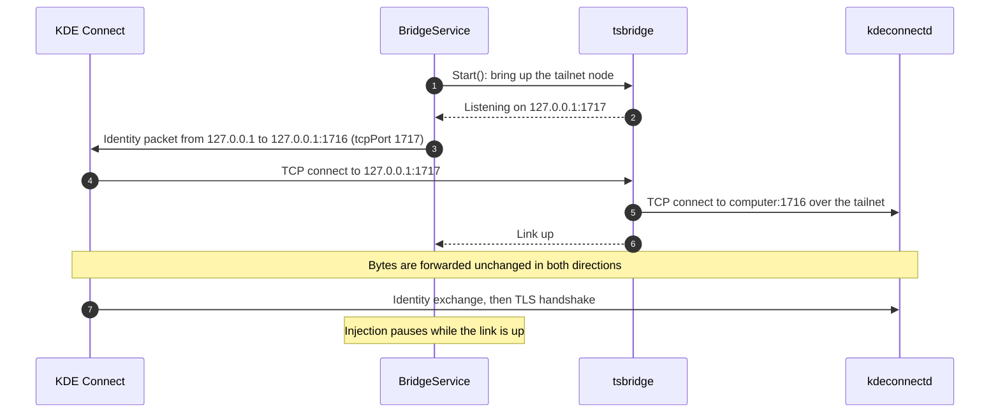
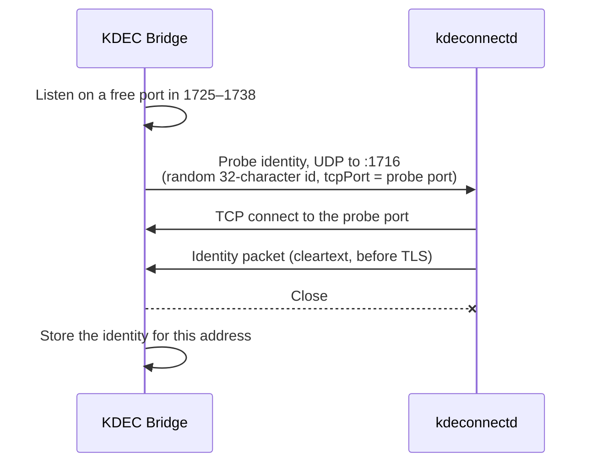
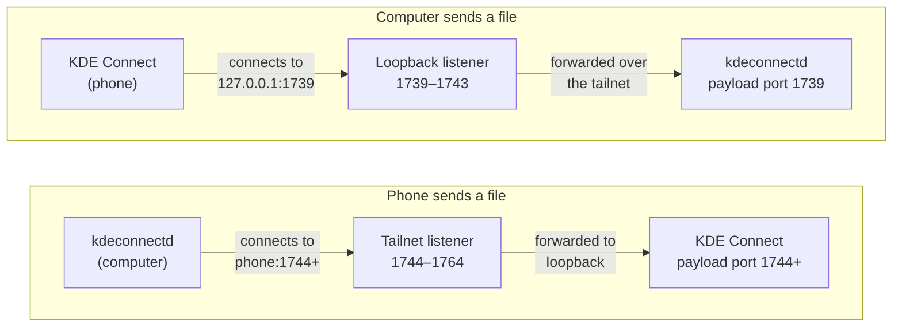
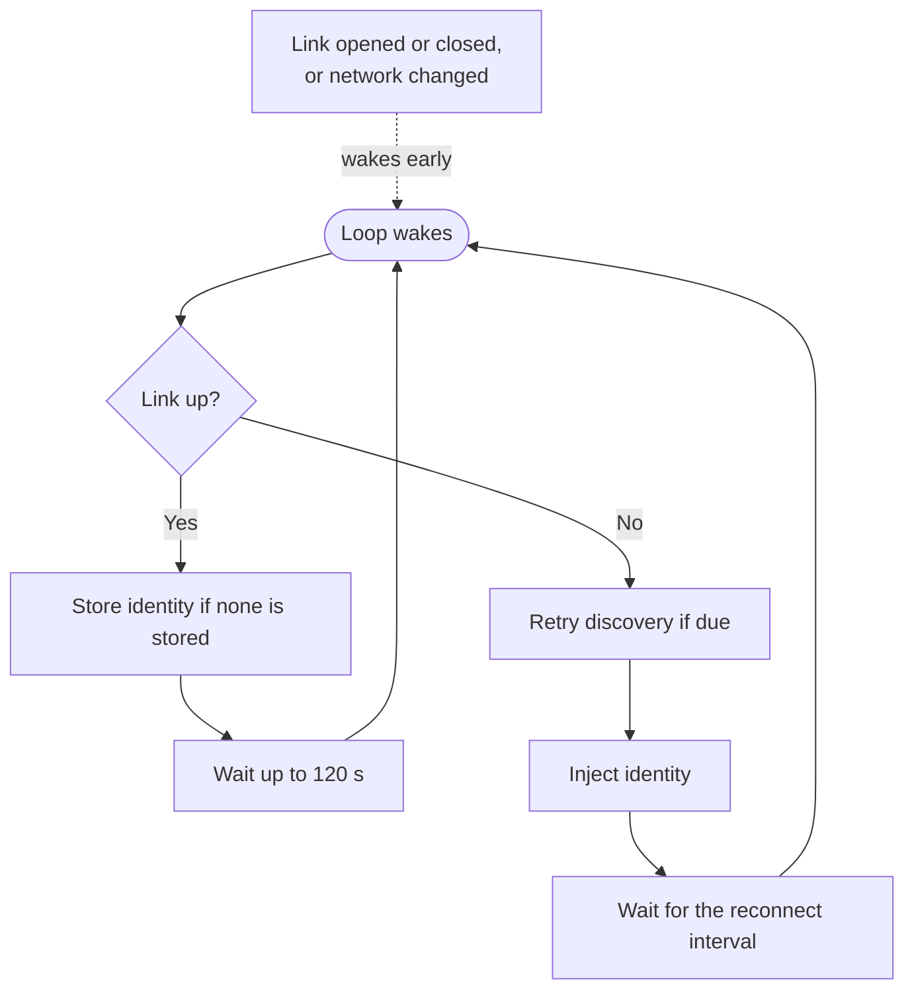
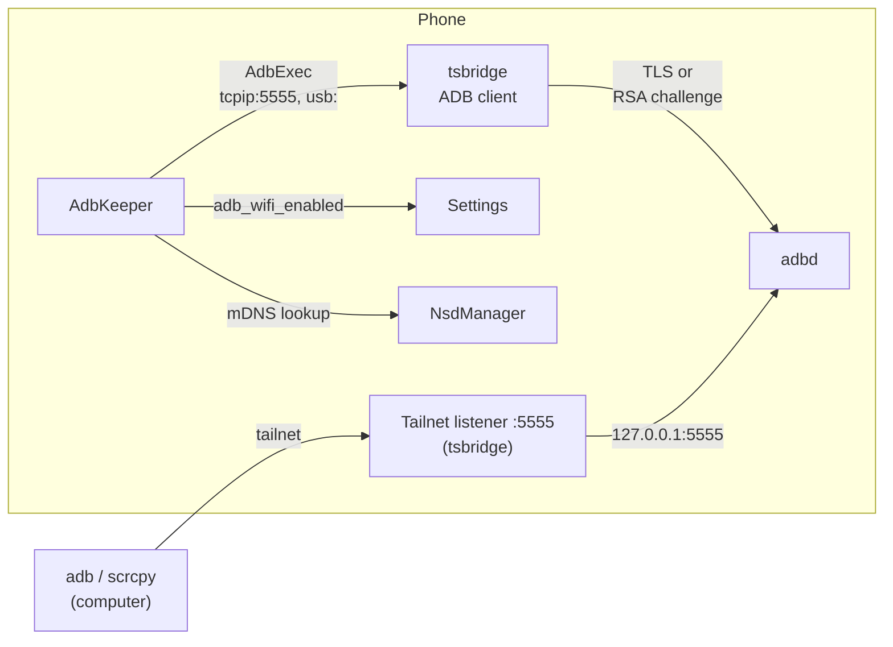
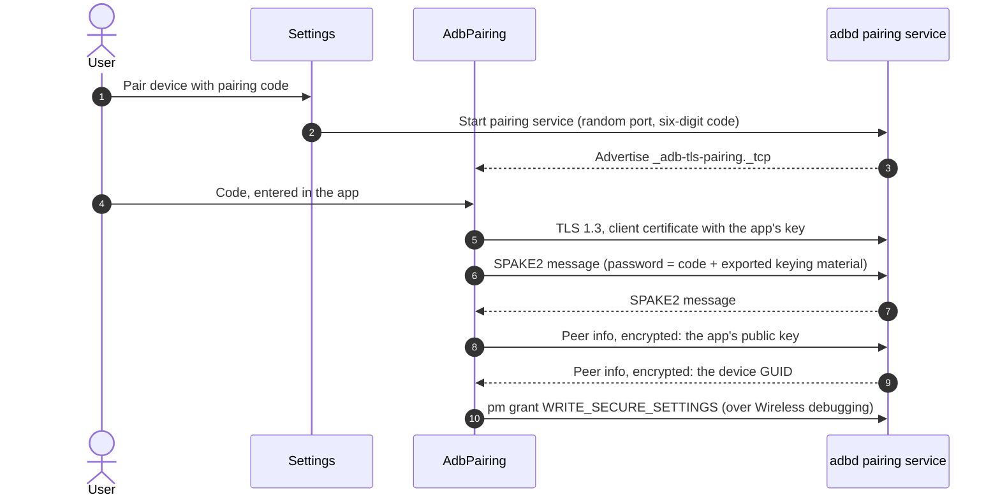
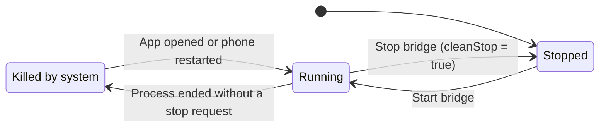

# Architecture

This document describes how KDEC Bridge carries KDE Connect and ADB between an Android phone and a computer over a userspace Tailscale node. For installation, see [setup.md](setup.md).

- [Background](#background)
- [Components](#components)
- [KDE Connect](#kde-connect)
  - [Connection setup](#connection-setup)
  - [Computer identity](#computer-identity)
  - [File transfer](#file-transfer)
  - [Link monitoring](#link-monitoring)
- [ADB for scrcpy](#adb-for-scrcpy)
  - [Opening port 5555](#opening-port-5555)
  - [When the bridge checks](#when-the-bridge-checks)
  - [Closing port 5555](#closing-port-5555)
  - [Trusting the app's key](#trusting-the-apps-key)
  - [Pairing](#pairing)
- [Service lifecycle](#service-lifecycle)
- [Network exposure](#network-exposure)
- [Go library](#go-library)

## Background

Android allows one active `VpnService` at a time. The Tailscale app needs it, so it cannot run while another VPN app is connected. Without it, neither direction works across networks: KDE Connect on the phone cannot reach the computer, and `adb` on the computer cannot reach the phone.

KDEC Bridge runs Tailscale's `tsnet` inside the app instead: WireGuard and a userspace TCP/IP stack, with no TUN device. Only sockets opened through tsnet reach the tailnet; the ordinary sockets of other apps do not. Each service therefore needs its own way to hand connections to the bridge.

**KDE Connect** cannot be pointed at the tailnet. Its list of custom device addresses does not help: kdeconnect-android sends UDP announcements to those addresses but never opens a TCP connection to them. It opens TCP connections in one place, `LanLinkProvider.udpPacketReceived`:

```java
socket = SocketFactory.getDefault().createSocket(address, tcpPort);
```

`address` is the source of a received UDP identity packet, and `tcpPort` is the port that packet advertises. The socket is an ordinary kernel socket, so it cannot be routed into a userspace network stack. However, `NetworkHelper.isPrivateAddress()` accepts loopback addresses, so an identity packet sent from `127.0.0.1` makes KDE Connect connect to `127.0.0.1`. The bridge uses loopback as the meeting point: it listens on loopback, sends KDE Connect the computer's identity from loopback, and forwards the resulting connection over the tailnet.

**ADB** runs in the other direction: the computer connects to adbd on the phone. The bridge accepts these connections on the tailnet and forwards them to adbd on loopback. adbd must first listen on TCP, which only an ADB client can request, so the bridge also contains a small ADB client and uses it to keep adbd in TCP mode.

## Components

<p align="center">
  
</p>

| Component | Language | Service | Responsibility |
|---|---|---|---|
| `BridgeService` | Kotlin | Both | Foreground service. Starts the transport, runs the injection loop, tracks link state, records heartbeats, and tells `AdbKeeper` when to check port 5555 |
| `tsbridge` | Go (gomobile) | Both | tsnet node, loopback and tailnet listeners, identity discovery over the tailnet, and the ADB client |
| `MainActivity` | Kotlin | Both | Settings, controls, status and event log |
| `EventLog` | Kotlin | Both | Timestamped log file that survives the process being killed |
| `Injector` | Kotlin | KDE Connect | Sends identity packets to KDE Connect's UDP port on loopback |
| `IdentityDiscovery` | Kotlin | KDE Connect | Learns the computer's identity. Runs in Kotlin in direct mode and calls into Go in tsnet mode |
| `PortProxy`, `DirectTcpTransport` | Kotlin | KDE Connect | Loopback TCP forwarding in direct mode |
| `AdbKeeper` | Kotlin | ADB | Keeps adbd listening on TCP port 5555: opens and closes it, and decides when to open it again |
| `AdbPairing` | Kotlin | ADB | Pairing with Wireless debugging, with the code entered in the app or in a notification |
| `AdbServices` | Kotlin | ADB | Finds this phone's Wireless debugging services through mDNS |

## KDE Connect

KDE Connect connects from the phone to the computer. The bridge presents the computer to KDE Connect on loopback and forwards each connection over the tailnet.

### Connection setup



1. `BridgeService` starts the transport. In tsnet mode, `tsbridge.Start` brings up the tailnet node and binds the loopback listeners.
2. While KDE Connect is not connected, the injector sends the computer's identity packet from `127.0.0.1` to `127.0.0.1:1716`, with `tcpPort` set to the bound control port.
3. KDE Connect treats the packet as coming from a local device and connects to `127.0.0.1:1717`.
4. The bridge connects to the computer at `<address>:1716` and forwards bytes in both directions.
5. KDE Connect and `kdeconnectd` exchange identities and complete the TLS handshake. The bridge takes no part in either.

Injection stops while a link is up. When KDE Connect receives an identity packet for a device it is already connected to, `addOrUpdateLink()` resets the existing link, so injecting during a live link would drop it.

If port 1717 is taken (KDE Connect itself falls back to 1717 when 1716 is busy), the control listener binds the next free port up to 1738, and the injected packet advertises that port instead.

### Computer identity

KDE Connect only completes a connection for the device it expects: the `deviceId` in the identity packet must be the one under which the computer's certificate was pinned during pairing. The bridge therefore needs the computer's real identity packet. It obtains it in two ways.

#### Discovery



The bridge sends the computer a probe identity that advertises a port the bridge is listening on. The computer connects back and, as the protocol requires, sends its own identity packet in cleartext before the TLS upgrade. The bridge reads that line and closes the connection.

- The probe's device id is 32 random hexadecimal characters. kdeconnect-kde silently discards identity packets whose id does not match `^[a-zA-Z0-9_-]{32,38}$`.
- The computer accepts at most one connection per second from a given address, across TCP and UDP. A probe that arrives in the same second as another connection is dropped, so the probe is resent every 3 seconds until the computer connects back or the attempt times out after 20 seconds.
- In tsnet mode, discovery runs in Go over the tailnet. The UDP socket is kept open for the whole attempt, because netstack sends asynchronously and closing the socket straight after writing can discard the datagram.
- Discovery runs at start-up and is retried at most once a minute while no identity is stored and KDE Connect is disconnected. The retry matters because MagicDNS may not resolve in the first seconds after the node starts.

Discovery needs a path on which the computer can connect back to the phone. It works over the tailnet and on a LAN, but not through a relay.

#### Adoption

When a link comes up, the identity that was injected must be correct, because KDE Connect only completes the TLS handshake against the certificate pinned for that `deviceId`. If no identity is stored for the current address, the bridge stores the one in use.

#### Storage

Identities are stored per computer address, so several computers can be used by changing the address. Until an identity is stored, the bridge injects a placeholder with an all-zero device id. The placeholder matches no device and cannot pair.

### File transfer

KDE Connect sends files over separate payload connections. The sending side opens a server socket on the first free port in 1739–1764 and tells the receiving side which port to connect to. The bridge handles the two directions differently.



- **Computer to phone.** `kdeconnectd` listens on a payload port, normally 1739, and KDE Connect on the phone connects to that port at the link's address, which is `127.0.0.1`. The bridge's loopback listener on that port forwards the connection to the computer.
- **Phone to computer.** Because the bridge holds 1739–1743 on loopback, KDE Connect's payload server on the phone binds port 1744 or higher. The computer connects to that port at the phone's tailnet address, and the bridge's tailnet listener forwards the connection to loopback.

Five loopback ports are enough in practice, because `kdeconnectd` takes the first free port and releases it when the transfer ends. Even concurrent transfers were observed to use port 1739.

In direct mode, the bridge forwards the full range 1739–1764 from loopback to the computer, adding the configured payload port offset.

### Link monitoring

The injection loop runs on its own thread and does not poll while connected.



- **Connected:** the loop waits until a link change or network change wakes it, or 120 seconds pass. The timeout doubles as the heartbeat.
- **Disconnected:** the loop retries discovery if due, injects the identity, and waits for the reconnect interval (10 seconds by default).

Link changes are reported by `PortProxy` in direct mode and by the Go `LinkWatcher` in tsnet mode. Only established upstream connections count as a live link, so a failing connection attempt never looks like a working one. A forwarded connection is torn down as soon as either side closes it; KDE Connect does not use TCP half-close, and waiting for both directions would keep a dead link open until TCP timed out. As a result, a computer going offline is detected within a second.

A `ConnectivityManager` network callback wakes the loop when the phone changes networks.

## ADB for scrcpy

ADB connects from the computer to the phone. The bridge accepts each connection on the tailnet, forwards it to adbd on loopback, and keeps adbd in TCP mode so that there is a port to forward to.

adbd, the ADB daemon on the phone, listens on TCP port 5555 after `adb tcpip 5555` and stops after `adb usb` or a restart. Only an ADB client can make these requests. Android 11 added Wireless debugging, which accepts TLS connections from trusted keys while the phone is on Wi-Fi. KDEC Bridge has its own key trusted once, and from then on acts as an ADB client to adbd on the same phone. No computer is involved after that.



The tailnet listener forwards connections to `127.0.0.1:5555` unchanged, like the other reverse listeners. It exists only while TCP ADB is on in the app and the transport is tsnet.

### Opening port 5555

```mermaid
sequenceDiagram
    autonumber
    participant K as AdbKeeper
    participant S as Settings
    participant N as NsdManager
    participant D as adbd
    K->>K: Port 5555 closed, TCP ADB on, phone on Wi-Fi
    K->>S: adb_wifi_enabled = 1
    S->>D: Start Wireless debugging (TLS on a random port)
    D-->>N: Advertise _adb-tls-connect._tcp
    K->>N: Discover and resolve; keep the service on this phone
    K->>D: CNXN, STLS, TLS 1.3 handshake with the app's key
    K->>D: OPEN tcpip:5555
    D-->>K: restarting in TCP mode port: 5555
    D->>D: Restart and listen on :5555
    K->>S: adb_wifi_enabled = 0, if it was off before
```

- `adb_wifi_enabled` is a secure setting. Once its key is trusted, the app grants itself `WRITE_SECURE_SETTINGS` by running `pm grant` over its first ADB connection.
- adbd picks a random port for Wireless debugging and advertises it only through mDNS. Other devices on the network advertise the same service type, so only a service that resolves to one of the phone's own addresses is used. The client connects over loopback and falls back to the advertised address.
- Turning Wireless debugging off, leaving Wi-Fi and changing networks do not close port 5555. A restart does, and so does turning USB debugging off.
- Android allows Wireless debugging only on Wi-Fi networks the user has allowed. On any other network it sets `adb_wifi_enabled` back to 0 at once. With the screen unlocked it also asks the user, so the bridge waits up to 30 seconds for an answer. With the screen locked it does not ask, so the attempt ends immediately, and automatic attempts skip that network until it reconnects or TCP ADB is turned on from the app.

### When the bridge checks

| Trigger | Source |
|---|---|
| Service start, including after a reboot or an app update | `BridgeService.startBridge` |
| The phone joins a Wi-Fi network | `ConnectivityManager` callback for Wi-Fi networks |
| USB debugging is turned on or off | `ContentObserver` on `adb_enabled`, 3 seconds after the change |
| At most every 10 minutes | Injection loop |
| **Turn on TCP ADB** | Button; also retries a network that was refused |

Every check first connects to `127.0.0.1:5555` and stops there if adbd accepts. Checks run one at a time on a single worker thread. The bridge never turns USB debugging on; while it is off, the check reports `USB debugging is off` and waits for the setting to change.

### Closing port 5555

**Turn off TCP ADB** closes the tailnet listener, connects to `127.0.0.1:5555` with the app's key, answers adbd's RSA challenge and sends `usb:`, the request behind `adb usb`. adbd restarts in USB-only mode. If port 5555 refuses the key, the app sends `usb:` over Wireless debugging instead. It then sets `adb_wifi_enabled` to 0 and clears the setting that keeps TCP ADB on, so no later check opens the port again.

### Trusting the app's key

adbd keeps one list of trusted keys for USB, classic TCP and Wireless debugging. A key allowed through the "Allow USB debugging?" prompt with **Always allow** is also accepted by Wireless debugging. The app can get its key trusted in two ways:

| Method | Needs | How |
|---|---|---|
| Prompt | Port 5555 already open, for example after `adb tcpip 5555` from a computer | The app connects to `127.0.0.1:5555`, answers the RSA challenge, and offers its public key when the signature is refused. adbd shows the prompt; once the user allows it, adbd sends CNXN |
| Pairing | Wireless debugging on, Android 11 or later | Pairing with a six-digit code, below |

After the prompt, adbd reloads its key list a moment later, so the app retries its first connection for a few seconds. If the key is still refused, **Always allow** was not ticked, and the app asks the user to repeat the prompt.

### Pairing



Some phones close the pairing dialog, and stop the pairing service, as soon as Settings loses focus, including when the notification shade is pulled down. The code is therefore entered in the app with both apps in split screen. Where the dialog stays open, the reply field of a notification also takes it.

The pairing protocol follows adb's implementation:

1. The client opens a TLS 1.3 connection to the pairing port and presents a self-signed certificate for its RSA key.
2. Both sides export 64 bytes of keying material from the TLS session with the label `adb-label\0`. The SPAKE2 password is the pairing code followed by these bytes, which binds the code to the TLS session.
3. Both sides exchange SPAKE2 messages over edwards25519, compatible with BoringSSL's `SPAKE2_*` functions, with the names `adb pair client` and `adb pair server`.
4. HKDF-SHA256 derives an AES-128-GCM key from the SPAKE2 key, with the info string `adb pairing_auth aes-128-gcm key`.
5. Each side sends an encrypted 8192-byte peer info block. The app sends its public key in adb's format; adbd replies with its GUID. A wrong code makes decryption fail, and adbd closes the connection.

Each message is prefixed by a 6-byte header: version (1), type (0 for SPAKE2, 1 for peer info) and the payload length in big-endian order.

The app's key is a 2048-bit RSA key, created on first use and stored in the app's private storage (`files/adb/adbkey`), which is excluded from backups. Its name, shown on the prompt and under **Paired devices** in Wireless debugging, is `kdec-bridge@android`.

## Service lifecycle



- The service is a foreground service with the `specialUse` type.
- On start, it sets `enabled` and clears `cleanStop`. A stop from the app or the notification sets `cleanStop`.
- Every pass of the injection loop records a heartbeat, at least every 120 seconds.
- When the app starts and finds the bridge enabled but not running, and `cleanStop` is not set, the service was killed. The app writes one log entry dated from the last heartbeat and restarts the bridge.
- `BootReceiver` restarts the bridge after a reboot or an app update if it was enabled.
- While it runs, the service registers a callback for Wi-Fi networks and an observer on the USB debugging setting, so that `AdbKeeper` can open port 5555 again when possible. See [When the bridge checks](#when-the-bridge-checks).
- If tsnet fails to start, for example at boot before the network is available, the start is retried with exponential backoff from 5 to 60 seconds.
- Stopping tsnet closes sockets and can abort a pending login, so it runs off the main thread; a following start waits for it to finish.

## Network exposure

| Listener | Interface | Accepts connections from | When |
|---|---|---|---|
| 1717 (up to 1738), 1739–1743 | Loopback | Apps on the phone, meaning KDE Connect | While the bridge runs |
| 1744–1764 | Tailnet | Tailnet peers: the computer, for file transfers | While the bridge runs |
| 1725–1738 | Tailnet | The computer, connecting back during identity discovery | During discovery |
| 5555 (bridge) | Tailnet | Tailnet peers: `adb` and scrcpy | While TCP ADB is on |
| 5555 (adbd) | All interfaces | Any network the phone is on | While TCP ADB is on |

In direct mode, all KDE Connect listeners are on loopback, and the bridge opens no tailnet listeners.

- Loopback listeners accept connections from any app on the phone. KDE Connect's TLS session and certificate pinning still apply end to end, so a connection from another app cannot impersonate the computer.
- adbd in TCP mode listens on all interfaces, not only on loopback and the tailnet. Classic ADB over TCP authenticates keys but does not encrypt; traffic through the tailnet is encrypted by WireGuard.
- Computers connecting on port 5555 must be allowed on the phone, as with USB.
- The app connects only to adbd on the phone itself. It does not connect to other devices' ADB services.

## Go library

The Go library's Android-specific behavior, such as network interface enumeration, the log state directory and panics across JNI, and its ADB client are described in [tsbridge/README.md](../tsbridge/README.md).
