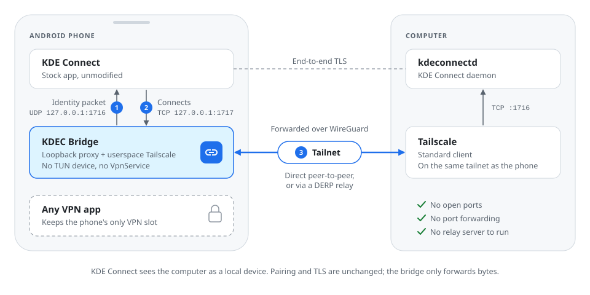
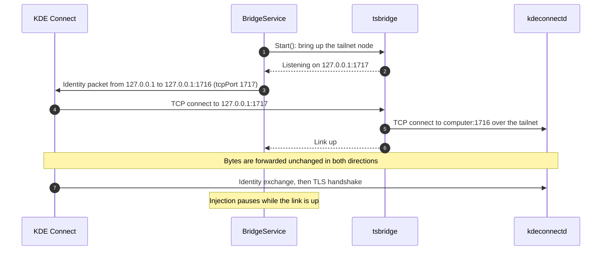
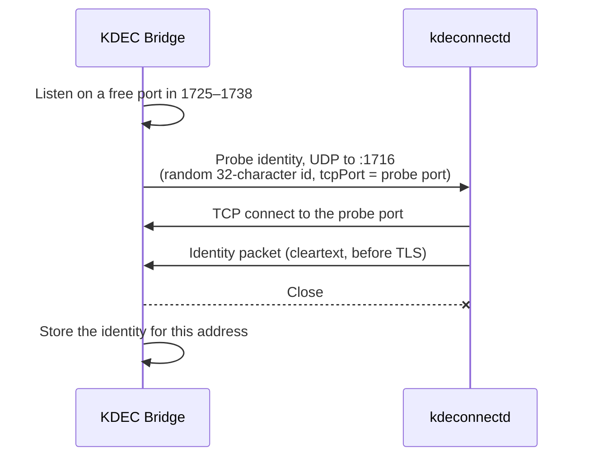
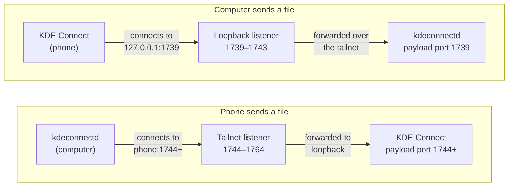
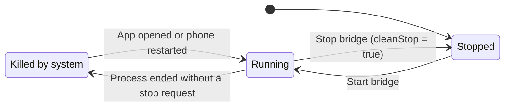

# Architecture

This document describes how KDEC Bridge connects the stock KDE Connect app to a remote computer. For installation, see [setup.md](setup.md).

- [Background](#background)
- [Components](#components)
- [Connection setup](#connection-setup)
- [Computer identity](#computer-identity)
- [File transfer](#file-transfer)
- [Link monitoring](#link-monitoring)
- [Service lifecycle](#service-lifecycle)

## Background

Android allows one active `VpnService` at a time. The Tailscale app needs it, so it cannot run while another VPN app is connected, and without Tailscale, KDE Connect on the phone cannot reach a computer outside the local network.

KDE Connect's list of custom device addresses does not help: kdeconnect-android sends UDP announcements to those addresses but never opens a TCP connection to them. It opens TCP connections in one place, `LanLinkProvider.udpPacketReceived`:

```java
socket = SocketFactory.getDefault().createSocket(address, tcpPort);
```

`address` is the source of a received UDP identity packet, and `tcpPort` is the port that packet advertises. The socket is an ordinary kernel socket, so it cannot be routed into a userspace network stack. However, `NetworkHelper.isPrivateAddress()` accepts loopback addresses, so an identity packet sent from `127.0.0.1` makes KDE Connect connect to `127.0.0.1`.

KDEC Bridge uses loopback as the meeting point. It listens on loopback, sends KDE Connect the computer's identity from loopback, and forwards the resulting connection to the computer through a Tailscale node that runs inside the app.

## Components

<p align="center">
  
</p>

| Component | Language | Responsibility |
|---|---|---|
| `BridgeService` | Kotlin | Foreground service. Starts the transport, runs the injection loop, tracks link state and records heartbeats |
| `Injector` | Kotlin | Sends identity packets to KDE Connect's UDP port on loopback |
| `IdentityDiscovery` | Kotlin | Learns the computer's identity. Runs in Kotlin in direct mode and calls into Go in tsnet mode |
| `PortProxy`, `DirectTcpTransport` | Kotlin | Loopback TCP forwarding in direct mode |
| `tsbridge` | Go (gomobile) | tsnet node, loopback and tailnet listeners, and identity discovery over the tailnet |
| `MainActivity` | Kotlin | Settings, controls, status and event log |
| `EventLog` | Kotlin | Timestamped log file that survives the process being killed |

## Connection setup



1. `BridgeService` starts the transport. In tsnet mode, `tsbridge.Start` brings up the tailnet node and binds the loopback listeners.
2. While KDE Connect is not connected, the injector sends the computer's identity packet from `127.0.0.1` to `127.0.0.1:1716`, with `tcpPort` set to the bound control port.
3. KDE Connect treats the packet as coming from a local device and connects to `127.0.0.1:1717`.
4. The bridge connects to the computer at `<address>:1716` and forwards bytes in both directions.
5. KDE Connect and `kdeconnectd` exchange identities and complete the TLS handshake. The bridge takes no part in either.

Injection stops while a link is up. When KDE Connect receives an identity packet for a device it is already connected to, `addOrUpdateLink()` resets the existing link, so injecting during a live link would drop it.

If port 1717 is taken (KDE Connect itself falls back to 1717 when 1716 is busy), the control listener binds the next free port up to 1738, and the injected packet advertises that port instead.

## Computer identity

KDE Connect only completes a connection for the device it expects: the `deviceId` in the identity packet must be the one under which the computer's certificate was pinned during pairing. The bridge therefore needs the computer's real identity packet. It obtains it in two ways.

### Discovery



The bridge sends the computer a probe identity that advertises a port the bridge is listening on. The computer connects back and, as the protocol requires, sends its own identity packet in cleartext before the TLS upgrade. The bridge reads that line and closes the connection.

- The probe's device id is 32 random hexadecimal characters. kdeconnect-kde silently discards identity packets whose id does not match `^[a-zA-Z0-9_-]{32,38}$`.
- The computer accepts at most one connection per second from a given address, across TCP and UDP. A probe that arrives in the same second as another connection is dropped, so the probe is resent every 3 seconds until the computer connects back or the attempt times out after 20 seconds.
- In tsnet mode, discovery runs in Go over the tailnet. The UDP socket is kept open for the whole attempt, because netstack sends asynchronously and closing the socket straight after writing can discard the datagram.
- Discovery runs at start-up and is retried at most once a minute while no identity is stored and KDE Connect is disconnected. The retry matters because MagicDNS may not resolve in the first seconds after the node starts.

Discovery needs a path on which the computer can connect back to the phone. It works over the tailnet and on a LAN, but not through a relay.

### Adoption

When a link comes up, the identity that was injected must be correct, because KDE Connect only completes the TLS handshake against the certificate pinned for that `deviceId`. If no identity is stored for the current address, the bridge stores the one in use.

### Storage

Identities are stored per computer address, so several computers can be used by changing the address. Until an identity is stored, the bridge injects a placeholder with an all-zero device id. The placeholder matches no device and cannot pair.

## File transfer

KDE Connect sends files over separate payload connections. The sending side opens a server socket on the first free port in 1739–1764 and tells the receiving side which port to connect to. The bridge handles the two directions differently.



- **Computer to phone.** `kdeconnectd` listens on a payload port, normally 1739, and KDE Connect on the phone connects to that port at the link's address, which is `127.0.0.1`. The bridge's loopback listener on that port forwards the connection to the computer.
- **Phone to computer.** Because the bridge holds 1739–1743 on loopback, KDE Connect's payload server on the phone binds port 1744 or higher. The computer connects to that port at the phone's tailnet address, and the bridge's tailnet listener forwards the connection to loopback.

Five loopback ports are enough in practice, because `kdeconnectd` takes the first free port and releases it when the transfer ends. Even concurrent transfers were observed to use port 1739.

In direct mode, the bridge forwards the full range 1739–1764 from loopback to the computer, adding the configured payload port offset.

## Link monitoring

The injection loop runs on its own thread and does not poll while connected.


- **Connected:** the loop waits until a link change or network change wakes it, or 120 seconds pass. The timeout doubles as the heartbeat.
- **Disconnected:** the loop retries discovery if due, injects the identity, and waits for the reconnect interval (10 seconds by default).

Link changes are reported by `PortProxy` in direct mode and by the Go `LinkWatcher` in tsnet mode. Only established upstream connections count as a live link, so a failing connection attempt never looks like a working one. A forwarded connection is torn down as soon as either side closes it; KDE Connect does not use TCP half-close, and waiting for both directions would keep a dead link open until TCP timed out. As a result, a computer going offline is detected within a second.

A `ConnectivityManager` network callback wakes the loop when the phone changes networks.

## Service lifecycle



- The service is a foreground service with the `specialUse` type.
- On start, it sets `enabled` and clears `cleanStop`. A stop from the app or the notification sets `cleanStop`.
- Every pass of the injection loop records a heartbeat, at least every 120 seconds.
- When the app starts and finds the bridge enabled but not running, and `cleanStop` is not set, the service was killed. The app writes one log entry dated from the last heartbeat and restarts the bridge.
- `BootReceiver` restarts the bridge after a reboot if it was enabled.
- If tsnet fails to start, for example at boot before the network is available, the start is retried with exponential backoff from 5 to 60 seconds.
- Stopping tsnet closes sockets and can abort a pending login, so it runs off the main thread; a following start waits for it to finish.

## Go library

The Android-specific problems solved in `tsbridge`, such as network interface enumeration, the log state directory and panics across JNI, are described in [tsbridge/README.md](../tsbridge/README.md).
