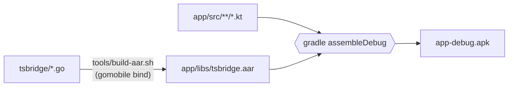

# Building

The app has two parts: the Android app in Kotlin (`app/`), and a Go library (`tsbridge/`) that gomobile compiles into an Android archive, `app/libs/tsbridge.aar`. Build the library first, then the app.



## Requirements

| Tool | Version | Notes |
|---|---|---|
| JDK | 21 | Gradle 8.11 does not run on JDK 24 or later |
| Gradle | 8.11 | |
| Android SDK | Platform 35, Build-Tools 35 | |
| Android NDK | 27.2 | Used by gomobile |
| Go | 1.27.1 or later | As declared in `tsbridge/go.mod` |
| gomobile | Current | `golang.org/x/mobile/cmd/gomobile` |

## Environment

Point the build at the toolchain, adjusting the paths to your installation:

```bash
export JAVA_HOME=/path/to/jdk-21
export ANDROID_HOME=/path/to/android-sdk
export ANDROID_NDK_HOME="$ANDROID_HOME/ndk/27.2.12479018"
export PATH="$JAVA_HOME/bin:$(go env GOPATH)/bin:$PATH"
```

With `ANDROID_HOME` set, no `local.properties` file is needed.

Install gomobile once:

```bash
go install golang.org/x/mobile/cmd/gomobile@latest
gomobile init
```

`tsbridge/go.mod` already depends on `golang.org/x/mobile`, which `gomobile bind` requires. `javac` must be on `PATH` while gomobile runs.

## Build

```bash
./tools/build-aar.sh      # builds app/libs/tsbridge.aar
gradle assembleDebug      # builds app/build/outputs/apk/debug/app-debug.apk
```

Install on a connected phone:

```bash
adb install -r app/build/outputs/apk/debug/app-debug.apk
```

## Build notes

**Build directory.** `tools/build-aar.sh` copies `tsbridge/` to a fixed temporary directory (`/tmp/kdec-aar-build`, or `$WORK_DIR` if set) and builds there. gomobile records the module's directory in the library's build information, and `-trimpath` does not remove it. Building from a fixed path keeps the output independent of where the repository is checked out.

**Size.** `-ldflags "-s -w"` strips Go symbol tables, which roughly halves the size of both the library and the APK.

**16 KB page alignment.** Android 15 and later support devices with 16 KB memory pages, which require native libraries aligned to 16 KB. gomobile produces 4 KB alignment by default, so the build links with `-extldflags=-Wl,-z,max-page-size=16384`. To check:

```bash
unzip -p app/libs/tsbridge.aar jni/arm64-v8a/libgojni.so > /tmp/libgojni.so
readelf -lW /tmp/libgojni.so | grep LOAD    # alignment column should read 0x4000
```

**ABI.** The library is built for `arm64-v8a` only, and `app/build.gradle.kts` restricts the APK to the same ABI.

## Release builds

A release build is not debuggable and must be signed before it can be installed. Create a signing key once, keep it outside the repository, and back it up: every update must be signed with the same key.

```bash
keytool -genkeypair -v -keystore /path/to/release.jks -alias kdec-bridge -keyalg RSA -keysize 4096 -validity 10000 -dname "CN=<publisher name>"
```

Build, sign and verify:

```bash
gradle assembleRelease
apksigner sign --ks /path/to/release.jks --ks-key-alias kdec-bridge --out kdec-bridge-vX.Y.apk app/build/outputs/apk/release/app-release-unsigned.apk
apksigner verify --print-certs kdec-bridge-vX.Y.apk
```

`apksigner` is in the Android SDK's `build-tools/<version>/` directory. Increase `versionCode` and `versionName` in `app/build.gradle.kts` for each release.

## Testing

The service is not exported. To start the bridge without using the UI, launch the activity with the `autostart` extra:

```bash
adb shell am start -n dev.kdecbridge/.MainActivity --ez autostart true
adb logcat -s KdecBridge:I
```

The persistent event log is readable on debug builds:

```bash
adb shell run-as dev.kdecbridge cat files/events.log
```
