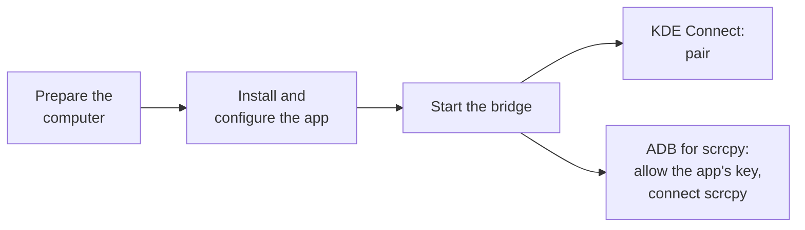

# Setup

This guide sets up the bridge on a phone, then each service it carries: KDE Connect, and ADB for scrcpy. It takes about ten minutes for the bridge and KDE Connect, and five more for ADB.



- [Before you start](#before-you-start)
- [The bridge](#the-bridge)
- [KDE Connect](#kde-connect)
- [ADB for scrcpy](#adb-for-scrcpy)
- [Troubleshooting](#troubleshooting)
- [Adding or replacing a computer](#adding-or-replacing-a-computer)
- [Moving to a new phone](#moving-to-a-new-phone)

## Before you start

**On the computer**

- Tailscale installed and logged in. Check with:

  ```bash
  tailscale status
  ```

- The computer's MagicDNS name, which you will enter in the app:

  ```bash
  tailscale status --json | grep -m1 '"DNSName"'
  ```

  It has the form `computer-name.your-tailnet.ts.net`. Omit the trailing dot. Use the name rather than the IP address, because the name stays the same if the node is registered again.
- For KDE Connect: KDE Connect installed, with `kdeconnectd` running.
- For ADB: [scrcpy](https://github.com/Genymobile/scrcpy) and `adb` installed.

**On the phone**

- For KDE Connect: the official KDE Connect app, from Google Play or F-Droid.
- For ADB: Android 11 or later, so that the bridge can open the ADB port by itself.
- Any VPN app you use can stay installed and connected.

## The bridge

### 1. Install the app

KDEC Bridge is not on any app store. Download the APK (`kdec-bridge-v*.apk`) from the [latest release](https://github.com/rnk-io/kdec-bridge/releases/latest) and open it on the phone. Android asks for permission to install apps from that source, such as your browser or file manager.

Alternatively, install it over USB with USB debugging enabled:

```bash
adb install -r kdec-bridge-v0.3.apk
```

The release page lists the file's SHA-256 checksum, which you can compare with `sha256sum` to confirm the download is intact. To build the APK yourself, see [building.md](building.md).

Updates install over the existing app and keep its settings. If a copy signed with a different key is already installed, for example your own debug build, Android refuses the update. Uninstall it first; the app then needs to be set up again.

### 2. Create an auth key (optional)

In the Tailscale admin console, open **Settings → Keys** and generate an auth key. A reusable key is fine.

Without a key, you can sign in from the app in step 4 instead.

### 3. Configure the app

Open **KDEC Bridge** and set:

| Setting | Value |
|---|---|
| Use Tailscale (tsnet) | Checked |
| Computer address | The MagicDNS name from above |
| Tailscale auth key | The key from step 2, or empty |
| Tailnet node name | Any name. The default is `kdec-bridge`. `adb` and scrcpy connect to this name |

Leave the remaining settings at their defaults.

### 4. Start the bridge

Tap **Start bridge**. The banner shows `○ CONNECTING…`.

- **With an auth key,** the node registers automatically.
- **Without a key,** the status shows `LOGIN NEEDED`. Tap **Authenticate tailnet**, approve the device in the browser, and return to the app.

Once the node has registered, the auth key is removed from the app's settings. The node's identity is then kept in the app's private storage.

### 5. Allow background operation

Tap **Exempt from battery optimization** and allow the exemption. Without it, Doze eventually stops the service, typically overnight.

Once the exemption is granted, the status shows `battery : exempt`.

### 6. Hide the notification (optional)

Android requires a foreground service to show a notification and does not let apps make it silent. To hide it, turn off the app's notifications:

**Settings → Apps → KDEC Bridge → Notifications → Off**

The service keeps running without a status bar icon. Android restarts the app's process when this permission changes, so open the app once afterwards. The app asks for notification permission only once, so the setting is kept.

## KDE Connect

### 7. Check the connection

Within a few seconds of starting the bridge, the banner should change to `● CONNECTED`. The event log at the bottom of the screen shows the sequence:

```
tailnet up as kdec-bridge
forward :1717->1716 + payload :1739-1743
identity: none learned yet - asking computer-name.your-tailnet.ts.net
identity: learned from my-computer (3f2a91c0…)
LINK UP - KDE Connect is connected
```

The app learns the computer's KDE Connect identity automatically and stores it for that address. It never needs to be entered by hand.

A `no such host` message in the first few seconds is expected. MagicDNS takes a moment to become available after the node starts, and the bridge retries.

### 8. Pair

Open KDE Connect on the phone. The computer appears as an available device. Pair as usual and accept the request on the computer.

Devices that were already paired reconnect without a prompt. The bridge does not change pairing or certificates.

## ADB for scrcpy

The bridge keeps the phone's ADB daemon listening on TCP port 5555 and forwards that port from the tailnet. To open the port by itself, the app needs adbd to trust its own ADB key, which is set up once in step 10.

### 9. Prepare the phone

1. Enable Developer options: in **Settings → About phone**, tap **Build number** seven times. On some phones it is under **Software information**.
2. In **Developer options**, turn on **USB debugging**.
3. Connect to Wi-Fi. In **Developer options → Wireless debugging**, turn Wireless debugging on. When Android asks, tick **Always allow on this network** and allow it.

The bridge can open the ADB port by itself only on Wi-Fi networks allowed this way, so repeat step 3 on each network where that should happen. Wireless debugging can be turned off again afterwards; the bridge turns it on for a moment when it needs it.

### 10. Allow the app's ADB key

Use either method.

**From a computer.** This is the quickest.

1. Connect the phone by USB and run:

   ```bash
   adb tcpip 5555
   ```

2. In KDEC Bridge, tap **Turn on TCP ADB**.
3. The phone shows **Allow USB debugging?** for `kdec-bridge@android`. Tick **Always allow from this computer** and tap **Allow**. Without the tick, the key is allowed for one connection only, and the app asks you to try again.

**By pairing with Wireless debugging.** No computer is needed.

1. In KDEC Bridge, tap **Turn on TCP ADB**. The app shows the pairing steps.
2. Open Settings and KDEC Bridge in split screen. In Settings, open **Developer options → Wireless debugging** and tap **Pair device with pairing code**.
3. Enter the six-digit code in the KDEC Bridge dialog and tap **Pair**.

Some phones close the pairing dialog as soon as Settings loses focus, including when the notification shade is pulled down, which is why split screen is needed. Where the dialog stays open, the code can also be entered in the reply field of the KDEC Bridge notification.

Either way, the `adb` line in the status then shows `on - :5555 open, forwarded from the tailnet`.

### 11. Connect from the computer

Connect by the phone's tailnet name, which is the **Tailnet node name** set in step 3:

```bash
scrcpy --tcpip=kdec-bridge.your-tailnet.ts.net:5555
```

For `adb` on its own:

```bash
adb connect kdec-bridge.your-tailnet.ts.net:5555
```

The first time, the phone asks to allow debugging from the computer, unless the computer has already been allowed over USB. Tick **Always allow from this computer** and allow it.

If the connection goes through a Tailscale relay, lower the bit rate and size, for example `--video-bit-rate=4M --max-size=1600`.

### Turning TCP ADB off

Tap **Turn off TCP ADB**. Port 5555 closes on every network, Wireless debugging is turned off, and the bridge stops opening the port. **Turn on TCP ADB** opens it again without another key prompt, once the phone is on an allowed Wi-Fi network.

Turning off USB debugging also closes port 5555. When USB debugging is turned on again, the bridge opens the port the next time the phone is on an allowed Wi-Fi network.

While TCP ADB is on, port 5555 is open on every network the phone uses, including public Wi-Fi. Computers still need to be allowed on the phone, so decline any debugging request you do not recognize. If the tailnet is shared, restrict port 5555 on the phone to your computer with a Tailscale access rule.

## Troubleshooting

The event log at the bottom of the app's screen is the first place to look. Entries from the running service also go to logcat:

```bash
adb logcat -s KdecBridge
```

On debug builds, the complete log file can be read over USB:

```bash
adb shell run-as dev.kdecbridge cat files/events.log
```

### The bridge

| Symptom | Cause and fix |
|---|---|
| `LOGIN NEEDED` does not clear | The node has not been approved. Tap **Authenticate tailnet**, or check the Tailscale admin console |
| Works, then stops overnight | The battery optimization exemption has not been granted |
| Banner shows `■ KILLED BY SYSTEM` | Android or a task killer stopped the service. The event log records when it was last running |

### KDE Connect

| Symptom | Cause and fix |
|---|---|
| `dial … connection refused` | The tailnet connection works, but `kdeconnectd` is not running on the computer |
| `dial … no such host` keeps repeating | The address is wrong, or the computer is offline |
| Connects, but KDE Connect does not pair | The stored identity does not match this computer. Tap **Forget learned identity** and restart the bridge |

### ADB for scrcpy

| Symptom | Cause and fix |
|---|---|
| `adb : key not allowed yet` | Tap **Turn on TCP ADB** and allow the app's key, as in step 10 |
| `adb : … allowed once only …` | **Always allow** was not ticked on the prompt. Tap **Turn on TCP ADB** again and tick it |
| `adb : … no longer allowed …` | The phone's debugging authorizations were revoked. Tap **Turn on TCP ADB** and allow the key again |
| `adb : waiting for Wi-Fi` | Port 5555 is closed, and opening it needs Wi-Fi. Connect to a Wi-Fi network allowed for Wireless debugging |
| `adb : Wireless debugging is not allowed on this Wi-Fi network …` | Turn on Wireless debugging once on this network, as in step 9. Or tap **Turn on TCP ADB** with the screen unlocked and allow the network |
| `adb : USB debugging is off` | Turn on USB debugging in Developer options |
| `pairing service not found` | Settings closed the pairing dialog before the code was entered. Pair in split screen |
| `adb connect` times out | TCP ADB is off, or the bridge is not running. Check the `adb` line in the status |
| `adb connect` reports `unauthorized` | Unlock the phone and allow debugging from the computer |

## Adding or replacing a computer

1. Put the computer on the tailnet and note its MagicDNS name.
2. Set **Computer address** to that name.
3. Start the bridge. It learns and stores the new computer's identity automatically.
4. Accept the KDE Connect pairing request. A different computer has a different certificate, so it must be paired once.
5. For ADB, connect from the new computer as in step 11 and allow it on the phone.

Identities are stored per address, so you can switch between computers by changing the address, and no rebuild is needed. If a computer keeps its name but its KDE Connect identity changes, for example after a reinstall, tap **Forget learned identity** and restart the bridge.

## Moving to a new phone

Install the app on the new phone and follow this guide from step 1. App data is not included in Android backups or device transfers, so the new phone registers as a new tailnet node and creates a new ADB key, which has to be allowed as in step 10. Remove the old node in the Tailscale admin console.
