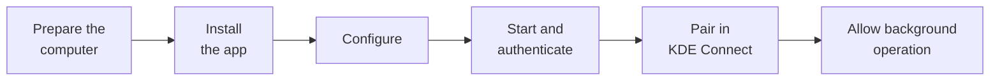

# Setup

This guide takes a phone from a fresh install to a working bridge. It takes about ten minutes.



## Before you start

**On the computer**

- KDE Connect installed, with `kdeconnectd` running.
- Tailscale installed and logged in. Check with:

  ```bash
  tailscale status
  ```

- The computer's MagicDNS name, which you will enter in the app:

  ```bash
  tailscale status --json | grep -m1 '"DNSName"'
  ```

  It has the form `computer-name.your-tailnet.ts.net`. Omit the trailing dot. Use the name rather than the IP address, because the name stays the same if the node is registered again.

**On the phone**

- The official KDE Connect app, from Google Play or F-Droid.
- KDEC Bridge is not on any app store; step 1 covers installing it.
- Any VPN app you use can stay installed and connected.

## 1. Install the app

Download the APK (`kdec-bridge-v*.apk`) from the [latest release](https://github.com/rnk-io/kdec-bridge/releases/latest) and open it on the phone. Android asks for permission to install apps from that source, such as your browser or file manager.

Alternatively, install it over USB with USB debugging enabled:

```bash
adb install -r kdec-bridge-v0.2.apk
```

The release page lists the file's SHA-256 checksum, which you can compare with `sha256sum` to confirm the download is intact. To build the APK yourself, see [building.md](building.md).

If a copy signed with a different key is already installed, for example your own debug build, Android refuses the update. Uninstall it first; the app then needs to be set up again.

## 2. Create an auth key (optional)

In the Tailscale admin console, open **Settings → Keys** and generate an auth key. A reusable key is fine.

Without a key, you can sign in from the app in step 4 instead.

## 3. Configure the app

Open **KDEC Bridge** and set:

| Setting | Value |
|---|---|
| Use Tailscale (tsnet) | Checked |
| Computer address | The MagicDNS name from above |
| Tailscale auth key | The key from step 2, or empty |
| Tailnet node name | Any name. The default is `kdec-bridge` |

Leave the remaining settings at their defaults.

## 4. Start the bridge

Tap **Start bridge**. The banner shows `○ CONNECTING…`.

- **With an auth key,** the node registers automatically.
- **Without a key,** the status shows `LOGIN NEEDED`. Tap **Authenticate tailnet**, approve the device in the browser, and return to the app.

Once the node has registered, the auth key is removed from the app's settings. The node's identity is then kept in the app's private storage.

## 5. Check the connection

Within a few seconds the banner should change to `● CONNECTED`. The event log at the bottom of the screen shows the sequence:

```
tailnet up as kdec-bridge
forward :1717->1716 + payload :1739-1743
identity: none learned yet - asking computer-name.your-tailnet.ts.net
identity: learned from my-computer (3f2a91c0…)
LINK UP - KDE Connect is connected
```

The app learns the computer's KDE Connect identity automatically and stores it for that address. It never needs to be entered by hand.

A `no such host` message in the first few seconds is expected. MagicDNS takes a moment to become available after the node starts, and the bridge retries.

## 6. Pair

Open KDE Connect on the phone. The computer appears as an available device. Pair as usual and accept the request on the computer.

Devices that were already paired reconnect without a prompt. The bridge does not change pairing or certificates.

## 7. Allow background operation

Tap **Exempt from battery optimization** and allow the exemption. Without it, Doze eventually stops the service, typically overnight.

Once the exemption is granted, the status shows `battery : exempt`.

## 8. Hide the notification (optional)

Android requires a foreground service to show a notification and does not let apps make it silent. To hide it, turn off the app's notifications:

**Settings → Apps → KDEC Bridge → Notifications → Off**

The service keeps running without a status bar icon. Android restarts the app's process when this permission changes, so open the app once afterwards. The app asks for notification permission only once, so the setting is kept.

## Troubleshooting

| Symptom | Cause and fix |
|---|---|
| `LOGIN NEEDED` does not clear | The node has not been approved. Tap **Authenticate tailnet**, or check the Tailscale admin console |
| `dial … connection refused` | The tailnet connection works, but `kdeconnectd` is not running on the computer |
| `dial … no such host` keeps repeating | The address is wrong, or the computer is offline |
| Connects, but KDE Connect does not pair | The stored identity does not match this computer. Tap **Forget learned identity** and restart the bridge |
| Works, then stops overnight | The battery optimization exemption has not been granted |
| Banner shows `■ KILLED BY SYSTEM` | Android or a task killer stopped the service. The event log records when it was last running |

On debug builds, the event log can also be read over USB:

```bash
adb shell run-as dev.kdecbridge cat files/events.log
```

## Adding or replacing a computer

1. Put the computer on the tailnet and note its MagicDNS name.
2. Set **Computer address** to that name.
3. Start the bridge. It learns and stores the new computer's identity automatically.
4. Accept the pairing request. A different computer has a different certificate, so it must be paired once.

Identities are stored per address, so you can switch between computers by changing the address, and no rebuild is needed. If a computer keeps its name but its KDE Connect identity changes, for example after a reinstall, tap **Forget learned identity** and restart the bridge.

## Moving to a new phone

Install the app on the new phone and follow this guide from step 1. App data is not included in Android backups or device transfers, so the new phone registers as a new tailnet node. Remove the old node in the Tailscale admin console.
